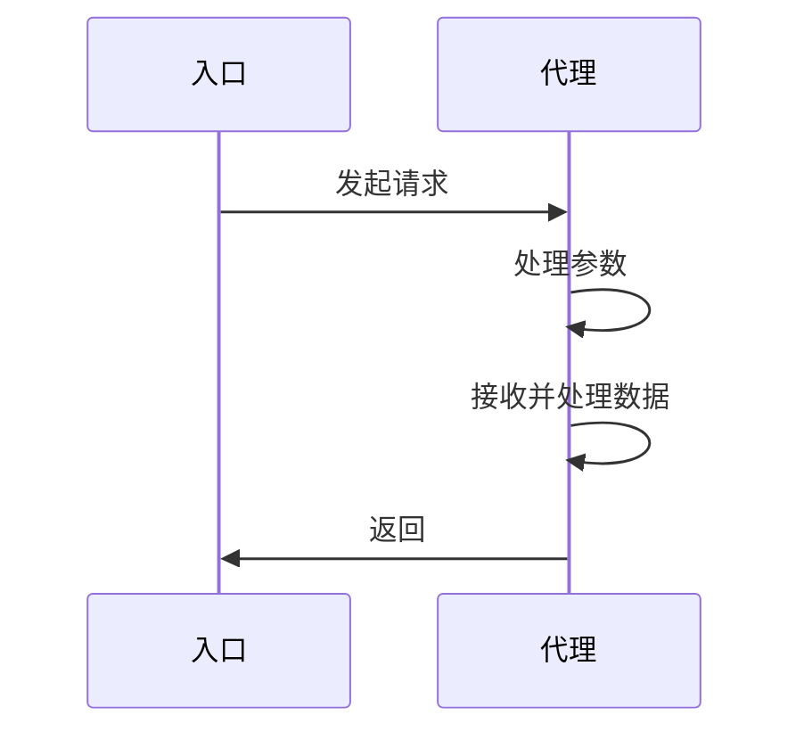
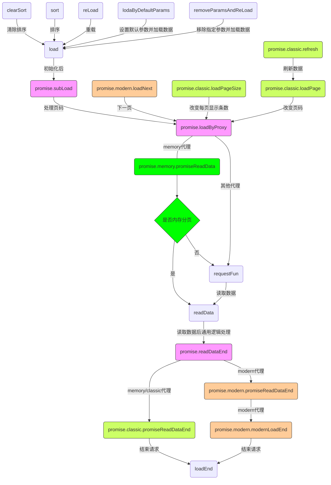

# 说明

这是一个数据代理扩展，灵感来至于 ExtJs 中的 `Ext.data.Store`

# 更新日志
## [2.0.3] - 2025-08-21

### 修复

* 修复忘记合并代码的错误

## [2.0.2] - 2025-08-15

### 优化

* 排序方法支持传入自定义排序参数

## [2.0.1] - 2025-02-09

### 优化

* 经典代理所有请求数据方法都会返回`Promise`对象

* 新增 setParams 方法

### 优化

* 经典代理所有请求方法都会返回`Promise`对象

## [2.0.0] - 2024-12-25

### 重构

* 基于工厂代理模式重构代码

## [1.2.8] - 2024-12-24

### 修复

* 找回被遗忘的`local`代理

## [1.2.7] - 2024-09-27

### 优化

* 所有代理都可以使用 loadNext

## [1.2.6] - 2024-07-15

### 新增

* 经典代理新增 loadPageByParams 方法

## [1.2.5] - 2024-05-15

### 优化

* 修复排序、加载函数参数不存在导致错误 bug

### 新增

* 内存代理新增 changeSort、removeItemByIndex 方法

## [1.2.4] - 2023-05-10

### 优化

* 修复移动端代理在处理空数据时状态错误 bug

### 新增

* proxy 对象中新增 maxPage（最大页码）
* 内存代理新增 loadData、pushData、filter、remove、removeByIds、removeAll、getAllData 方法

## [1.2.3] - 2022-06-08

### 变更

* loadSuccess 回调变更为 success

* refresh 方法只支持编辑/删除操作，并变更参数

### 优化

* 内存代理增强，新增自定义过滤方法

* 新增 end 回调

## [1.2.2] - 2022-04-15

### 变更

* 放弃 ts 改用传统 js 写法

* 调整内部方法名称

### 优化

* 内存代理增强，支持直接请求数据

## [1.2.1] - 2021-09-16

* 修复 clearEmptyParams 配置失效 bug

## [1.1.8] - 2021-09-09

* eslint 校验调整

## [1.1.6] - 2021-06-18

### 新增

* promise. 开头代理新增 `beforLoad` 扩展方法

## [1.1.5] - 2021-06-10

### 变更

* promise. 开头代理`clearEmpty` 配置改为 `clearPageParams`

### 新增

* promise. 开头代理新增 `clearPageParams` 配置

## [1.1.4] - 2021-06-08

### 变更

* `lodaByDefaultParams` 方法新增参数
* 变更 `lodash` 依赖版本

### 新增

* 新增 `reader.otherProperty` 配置
* promise. 开头代理新增 `clearEmpty` 配置
* 新增 `appendsDefaultParamsAndLoad`方法
* 新增 `removeParamsAndReLoad`方法
* 新增 `getAllparams`方法

### 优化

* 优化帮助类 `isEmpty` 方法
# 安装代理模块

npm install ux-data-proxy

## 使用

请求数据的方法与返回的数据需要遵循以下规则

1. 此帮助类只是一个代理类，具体分页、查询、排序功能函数还是需要 axios 等扩展来实现，但是因为设计时考虑了扩展性，可以自定义一些扩展来实现请求数据的功能

1. 返回数据必须是标准 json 格式数据，并且有以下字段，对应字段名称可以在 reader 配置中灵活配置，如果返回数据不标准可以用 readerTransform 函数处理成标准格式

   1. success -> 用于判断请求是否成功
   1. data -> 最终数据结果集
   1. total -> 满足当前条件的数据总数，用于分页
   1. message -> 用于请求失败消息提示

假如后端返回数据格式如下，使用 axios 请求数据并不做任何处理

```js
{
  "code": 1,
  "msg": "查询成功",
  "data": {
    "records": [{
      "id": 119,
      "name": "的鹅鹅鹅饿鹅",
      "telephone": "18888888888"
    }, {
      "id": 118,
      "name": "未命名",
      "telephone": "18899999999"
    }],
    "total": 62
  }
}
```

代理中 reader 配置如下即可

```js
    reader: {
      // 数据根节点
      rootProperty: "data.data.records",
      successProperty: "data.code",
      totalProperty: "data.data.total",
      messageProperty: 'data.data.msg'
    }
```

### promise.classic 代理实现分页查询等

vue 示例如下（vue3 写法，含扩展功能）

#### 全局配置

utils/data/proxy

```js
import proxy from 'ux-data-proxy';
import {
  defaultsDeep,
  has,
  toNumber
} from 'lodash';
// 默认配置
const defaultProxy = {
  autoLoad: true,
  reader: {
    // 数据根节点名称
    rootProperty: 'data',
    // 判断请求是否成功的节点名称
    successProperty: 'success',
    // 数据总数节点名称
    totalProperty: 'total',
    // 请求失败后失败消息节点名称
    messageProperty: 'msg'
  },
  limitParam: 'size',
  pageParam: 'current',
  // 后端返回数据格式不是我们想要的，在这里处理下
  readerTransform(data) {
    if (data.data) {
      const res = data.data;
      if (has(res, 'records')) {
        data.data = res.records || [];
        data.total = toNumber(res.total);
      }
    }
    return data;
  }
};
// 扩展数据请求代理
export default {
  /**
   * 初始化
   *
   * @param {*} store,数据源对象
   */
  init(store) {
    defaultsDeep(store.proxy, defaultProxy);
    proxy.init(store);
  }
};
```

#### 组合式 api

```js
import proxy from '@/utils/data/proxy';
import {
  assignIn,
  map,
  get,
  set,
  toNumber,
  toString,
  unset
} from 'lodash';
import {
  clearObject,
  isEmpty,
  checkCondition
} from '@/utils';

export function compositionTableData({
  transformParams,
  exportFun,
  idKey,
  ...config
} = {}) {
  // 数据代理
  const dataStore = reactive({
    // 可选分页页码集合
    pageSizes: [10, 20, 40, 60, 80, 100],
    // 当前已选数据，需手动调用 updateSelection 方法
    selection: [],
    // 必须配置否则无法展示数据
    data: [],
    // 必须配置否则无法实时展示请求状态
    isLoading: false,
    /**
     * 代理配置，用于加载数据
     * 用法参考 https://www.npmjs.com/package/ux-data-proxy
     * 常用配置
     * autoLoad(boole) 初始化后是否自动加载数据
     * disposeItem(function(item){item.a='123'}) 处理单个数据对象的函数
     * defaultParams(object) 默认参数,默认参数会被相同名称新参数覆盖，此参数传递到请求数据函数
     */
    proxy: {
      defaultParams: {}
    }
  });

  // 设置代理配置
  assignIn(dataStore, config);
  // 初始化数据代理
  proxy.init(dataStore);

  const getParams = (params) => {
    return transformParams ? transformParams(params) : params;
  };

  dataStore.transformParams = getParams;

  dataStore.loadByParams = (params) => {
    dataStore.load(getParams(params));
  };

  /**
   * 本地过滤数据源数据(promise.memory专用方法)
   *
   * @param {Object} params - 参数
   * @param {Object} options - 查询配置。
   */
  dataStore.filterByParams = (params = {}, options = {}) => {
    params = clearObject(params);
    // 断言条件集合
    const predicat = [];
    // eslint-disable-next-line no-unused-vars
    for (const key in params) {
      const type = options[key];
      const value = get(params, key);
      if (!isEmpty(value) && type) {
        switch (type) {
          case 'int':
            // 将查询值转换为int类型
            set(params, key, toNumber(value));
            break;
          case 'string':
            // 将查询值转换为string类型
            set(params, key, toString(value));
            break;
          case 'time': {
            // 按时间范围进行查询
            const [start, end] = value;
            const fun = (data) => {
              const time = get(data, key);
              return time >= start && time <= end;
            };
            predicat.push(fun);
            unset(params, key);
          }
          break;
        case 'regex': {
          // 模糊匹配查询
          const reg = new RegExp(value);
          const fun = (data) => reg.test(get(data, key));
          predicat.push(fun);
          unset(params, key);
        }
        break;
        default:
          break;
        }
      }
    }
    predicat.push(params);
    // console.log('predicat',predicat)
    dataStore.filter((item) => checkCondition(item, predicat));
  };

  /**
   * 动态设置序号
   *
   * @param {number} i - 当前页序号
   * @return {number} 新的序号
   */
  dataStore.computeIndex = (i) => {
    return i + 1 + dataStore.proxy.pageSize * (dataStore.proxy.page - 1);
  };

  /**
   * 导出文件，需配置 exportFun (可按需修改)
   *
   * @param {string} fileName - 导出文件名称
   * @param {object} params - 导出参数（默认情况下会使用当前查询条件作为参数）
   */
  dataStore.exportFile = ({
    joinString = ','
  } = {}) => {
    const params = dataStore.getParams() || {};
    const {
      ids
    } = dataStore.getSelectionData({
      iteratee: idKey,
      joinString
    });
    params.ids = ids;
    exportFun(params);
  };

  /**
   * 更新当前已选数据
   *
   * @param {type} selection - 已选数据
   */
  dataStore.updateSelection = (selection) => {
    dataStore.selection = selection;
  };

  /**
   * 获取当前已选数据(转换后，可按需修改)
   *
   * @param {Object} options - 配置
   * @param {string} [options.iteratee='id'] - lodash.map的iteratee
   * @param {string} options.joinString - 如果有值，则将结果拼接成字符串
   * @return {Object} 包含ids和长度的对象。
   */
  dataStore.getSelectionData = ({
    iteratee = 'id',
    joinString
  } = {}) => {
    let ids = [];
    if (dataStore.selection.length) {
      // 转换数据
      ids = map(dataStore.selection, iteratee);
    }
    const length = ids.length;
    if (joinString) {
      // 转换为字符串
      ids = ids.join(joinString);
    }
    return {
      ids,
      length
    };
  };

  /**
   * 对数据源进行排序（可按需修改）
   *
   * @param {Object} sortOptions - 排序选项。
   * @param {string} sortOptions.prop - 需要排序的字段
   * @param {string} sortOptions.order - 排序配置
   */
  dataStore.sortBy = ({
    prop,
    order
  }) => {
    let params;
    if (order) {
      params = {
        field: `${prop} ${order == 'ascending' ? 'asc' : 'desc'}`
      };
    }
    dataStore.sort(params);
  };

  return dataStore;
}
```

#### vue 页面

注意 fetchList 需要返回 Promise 对象

```html
<template>
  <div>
    <el-table :data="dataStore.data" border @selection-change="dataStore.updateSelection">
      <!-- 省略配置 -->
    </el-table>
    <el-pagination layout="total, prev, pager, next, sizes, jumper" background :current-page="dataStore.proxy.page" :page-size="dataStore.proxy.pageSize" :page-sizes="dataStore.pageSizes" :total="dataStore.proxy.total" @size-change="dataStore.loadPageSize($event)" @current-change="dataStore.loadPage($event)"></el-pagination>
  </div>
</template>

<script setup>
  import {
    compositionTableData
  } from '@/composition/table/Data';
  import {
    fetchList
  } from 'api地址';

  const dataStore = compositionTableData({
    proxy: {
      requestFun: fetchList
    }
  });
</script>
```

## 可用代理

### promise.classic

多用于 web 端获取列表数据，新数据会覆盖原有数据

### promise.modern

多用于移动端获取列表数据，新数据会追加到原有数据之后

### promise.memory

用于一次性请求数据后内存分页，用法同 promise.classic

## 可用配置

```js
// promise.开头代理预留方法
const defaultStore = {
  // 扩展，请求失败后执行函数(res)
  // res 请求失败结果数据集
  failure: null,
  // 扩展，请求数据前处理请求参数函数(params, proxy)
  // params 请求参数
  // proxy 代理对象
  writerTransform: null,
  // 扩展，请求数据成功后处理数据结果函数(res)
  // res 未处理的结果数据集
  readerTransform: null
};
// promise.modern代理数据源对象可用状态
const defaultStore = {
  // 是否加载完数据，所有数据加载完成就会变成true，可以修改
  isFinished: false,
  // 是否加载失败，禁止修改
  isError: false
};

// 所有代理可用配置
const defaultProxy = {
  // 代理类型，默认为经典代理
  type: 'promise.classic',
  // 默认参数,默认参数会被相同名称新参数覆盖，此参数传递到请求数据函数
  defaultParams: null,
  // 初始化后是否自动加载数据
  autoLoad: false,
  // 扩展 处理单个数据对象的函数(item,index)
  // item 单条数据
  // index 序号
  disposeItem: null,
  // 读取数据相关配置
  reader: {
    // 其他数据节点名称
    otherProperty: '',
    // 数据根节点名称
    rootProperty: 'data',
    // 判断请求是否成功的节点名称
    successProperty: 'success',
    // 数据总数节点名称
    totalProperty: 'total',
    // 请求失败后失败消息节点名称
    messageProperty: 'message'
  },
  // 排序字段名称
  sortParam: 'orderBy',
  // 排序方式字段名称
  directionParam: 'orderSort'
};

// promise.开头代理可用配置
const defaultProxy = {
  // 每次加载几条数据，默认为10
  pageSize: 10,
  // 当前页码，默认为1
  page: 1,
  // 数据总数，禁止更改
  total: 0,
  //最大页码
  maxPage: 0,
  // 分页每页显示条数字段名称，默认为limit，此参数传递到请求数据函数
  limitParam: 'limit',
  // 分页页码字段名称，默认为page，此参数传递到请求数据函数
  pageParam: 'page',
  // 扩展，请求数据前处理函数(proxy)
  // proxy 代理对象
  beforLoad: null,
  // 扩展，请求数据成功后回调函数(data,proxy,store)
  // data 结果输数据集
  // proxy 代理对象
  success: null,
  // 扩展，请求数据结束后回调函数(store)
  // proxy 代理对象
  end: null,
  // 扩展，请求失败后执行函数(store,res)
  // res 请求失败结果数据集
  // 此扩展会覆盖defaultStore中的配置
  failure: null,
  // 扩展，请求数据前处理请求参数函数(params, proxy)
  // params 请求参数
  // proxy 代理对象
  // 此扩展会覆盖defaultStore中的配置
  writerTransform: null,
  // 扩展，请求数据成功后处理数据结果函数(res)
  // res 未处理的结果数据集
  // 此扩展会覆盖defaultStore中的配置
  readerTransform: null,
  // 发送请求时是否清除空数据
  clearEmptyParams: true,
  // 发送请求时是否不发送分页参数
  clearPageParams: false
};

// promise.memory代理可用配置
// 其他同promise.classic
const defaultProxy = {
  // 发送请求时是否不发送分页参数
  clearPageParams: true
};
```

## 可用函数

### 通用函数

```js
    /**
     * 初始化,每个数据源对象必须初始化
     *
     * @param {*} store,数据源对象
     */
    init(store) {},
      /**
       * 数据源对象加载数据
       *
       * promise.开头的代理页码会重置为1
       *
       * local代理如果没有配置requestFun会根据dbName与path配置读取本地数据
       *
       * @param {object} params 查询参数
       */
      load(params) {},
      /**
       * 加载下一页数据
       *
       */
      loadNext() {},
      /**
       * 数据源对象重载数据(参数不会发生变化)
       *
       * promise.开头的代理页码会重置为1
       *
       * local代理如果没有配置requestFun会根据dbName与path配置读取本地数据
       */
      reLoad() {},
      /**
       * @description  设置默认参数并加载数据
       * @param {object} params 参数
       * @param {boolean} isReLoad 是否重载
       * @param {boolean} isAppends 是否追加默认参数
       */
      lodaByDefaultParams(params, {
        isReLoad = false,
        isAppends = false
      }) {},
      /**
       * 移除指定参数(包括默认参数)并加载数据
       *
       * @param {*} list 待移除的字符串数组
       * @param {boolean} [isReLoad=true] 是否重载
       */
      removeParamsAndReLoad(list, isReLoad = true) {},
      /**
       * 排序
       *
       * @param {*} { field 排序字段, order 排序方式}
       */
      sort({
        field,
        order
      }) {},
      /**
       * 清除排序
       *
       */
      clearSort() {},
      /**
       * @description  设置当前参数（排除分页、排序参数）
       * @param {object} params 参数
       */
      setParams(params) {},
      /**
       * 获取当前参数（排除分页参数）
       *
       * @returns
       */
      getParams() {},
      /**
       * 获取所有参数
       *
       * @returns
       */
      getAllparams() {}
```

### promise.classic/promise.memory 代理

```js
  /**
   * 数据源对象改变每页显示条数，页码重置为1
   *
   * @param {number} page
   */
  loadPageSize(pageSize) {},
    /**
     * 数据源对象改变页码
     *
     * @param {number} page
     */
    loadPage(page) {},
    /**
     * 刷新数据源对象，用于编辑/新增/删除后调用
     * 编辑后直接重载数据，页码不变
     * 新增后直接重新加载数据，页码重置为1
     * 删除后根据剩余数据总数和页面等灵活设置页码，不变或减1
     *
     * @param {*} [{ isDel = false 是否删除数据, isAdd = false 是否新增数据}={}]
     */
    /**
     * 数据源对象改变页码和参数
     *
     * @param {number} page
     *  @param {any} params
     */
    loadPageByParams(page, params) {},
    refresh({
      isDel = false,
      isAdd = false
    } = {}) {}
```

### promise.memory 代理

```js
/**
 * 将数据保存到内存中，然后分页处理
 *
 * @param {object} data - 数据
 */
loadData(data) {},
  /**
   * 将数据追加到内存代理中
   *
   * @param {*} data -数据
   * @param {boolean} isReLoad - 是否是重新加载
   */
  pushData(data, isReLoad) {},
  /**
   * 通过 predicate（断言函数） 从内存数据中过滤数据
   *
   * @export
   * @param {Array|Function|Object|String} predicat 断言函数
   */
  filter(predicat) {},
  /**
   * 通过 predicate（断言函数） 从内存数据中删除数据
   *
   * @export
   * @param {Array|Function|Object|String} predicat 断言函数
   */
  remove(predicat) {},
  /**
   * 从内存数据中删除指定 id 数据
   *
   * @param {Array} ids - 要删除的 id 数组。
   * @param {string} [key='id'] - 用于查找每个对象中 id 的键。
   */
  removeByIds(ids = [], key = 'id') {},
  /**
   * 清空所有数据
   */
  removeAll() {},
  /**
   * 更改序号
   *
   * @param {number} newIndex - 元素的新位置索引(当前分页)
   * @param {number} oldIndex - 元素当前的位置索引(当前分页)
   * @return {void}
   */
  changeSort(newIndex, oldIndex) {},

  /**
   * 通过索引移除数据
   *
   * @param {number} index - 要移除的项目的索引(当前分页)
   * @return {void}
   */
  removeItemByIndex(index) {}
/**
 * 获取所有数据
 */
getAllData() {}
```

## 设计思路

### 时序图

发起流程尽量简单，代理内部将参数和数据都处理好，并提供相应配置支持使用者自行扩展



### 流程图

核心代理实现核心功能，核心方法相同，各个子代理按需求实现不同功能并提供专属方法，目前有三种代理可用，根据代理类型自动选择子代理。

1. promise.modern
   移动端专用
1. promise.classic
   PC 端专用
1. promise.memory
   PC 端专用，在 promise.classic 基础上二次扩展，用于一次性请求所有数据后内存分页，只在调用 load 方法时才会发起请求更新数据。


