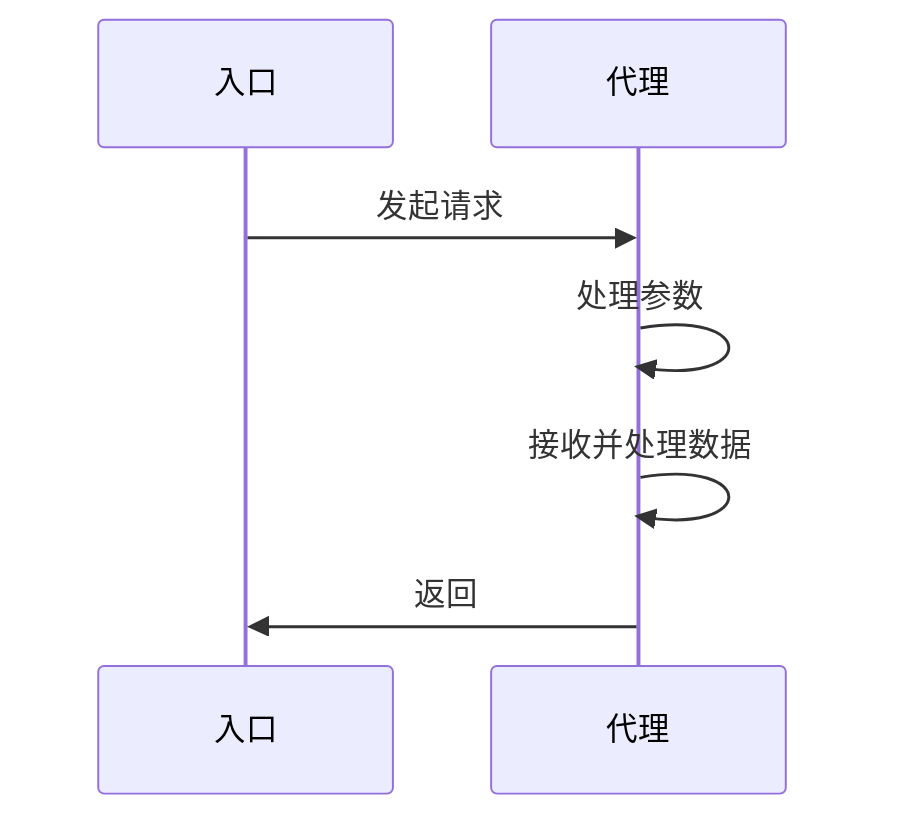
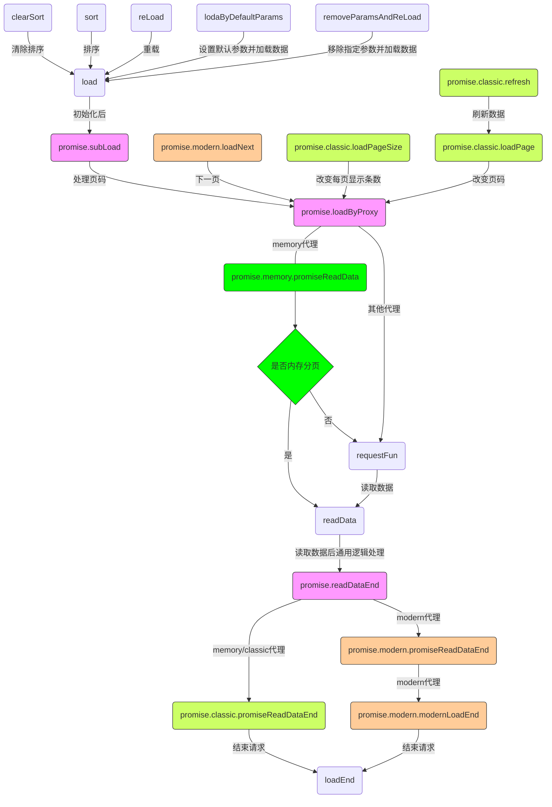

# 说明

这是一个数据代理扩展，灵感来至于 ExtJs 中的 `Ext.data.Store`

# 更新日志
## [1.2.7] - 2024-09-27

### 优化

*所有代理都可以使用loadNext

## [1.2.6] - 2024-07-15

### 新增

*经典代理新增loadPageByParams方法

## [1.2.5] - 2024-05-15

### 优化

*修复排序、加载函数参数不存在导致错误bug

### 新增

*内存代理新增changeSort、removeItemByIndex方法

## [1.2.4] - 2023-05-10

### 优化

*修复移动端代理在处理空数据时状态错误bug

### 新增

*proxy对象中新增maxPage（最大页码）

*内存代理新增loadData、pushData、filter、remove、removeByIds、removeAll、getAllData方法

## [1.2.3] - 2022-06-08

### 变更

*loadSuccess回调变更为success

*refresh方法只支持编辑/删除操作，并变更参数

### 优化

*内存代理增强，新增自定义过滤方法

*新增end回调

## [1.2.2] - 2022-04-15

### 变更

*放弃ts改用传统js写法

*调整内部方法名称

### 优化

*内存代理增强，支持直接请求数据

## [1.2.1] - 2021-09-16

*修复clearEmptyParams配置失效bug

## [1.1.8] - 2021-09-09

* eslint校验调整

## [1.1.6] - 2021-06-18

### 新增

* promise. 开头代理新增 `beforLoad` 扩展方法

## [1.1.5] - 2021-06-10

### 变更

* promise. 开头代理`clearEmpty` 配置改为 `clearPageParams`

### 新增

* promise. 开头代理新增 `clearPageParams` 配置

## [1.1.4] - 2021-06-08

### 变更

* `lodaByDefaultParams` 方法新增参数
* 变更 `lodash` 依赖版本

### 新增

* 新增 `reader.otherProperty` 配置
* promise. 开头代理新增 `clearEmpty` 配置
* 新增 `appendsDefaultParamsAndLoad`方法
* 新增 `removeParamsAndReLoad`方法
* 新增 `getAllparams`方法

### 优化

* 优化帮助类 `isEmpty` 方法

# 安装代理模块

npm install ux-data-proxy

## 使用

请求数据的方法与返回的数据需要遵循以下规则

1. 此帮助类只是一个代理类，具体分页、查询、排序功能函数还是需要 axios 等扩展来实现，但是因为设计时考虑了扩展性，可以自定义一些扩展来实现请求数据的功能

1. 返回数据必须是标准 json 格式数据，并且有以下字段，对应字段名称可以在 reader 配置中灵活配置，如果返回数据不标准可以用 readerTransform 函数处理成标准格式

   1. success -> 用于判断请求是否成功
   1. data -> 最终数据结果集
   1. total -> 满足当前条件的数据总数，用于分页
   1. message -> 用于请求失败消息提示

假如后端返回数据格式如下，使用 axios 请求数据并不做任何处理

```js
{
  "code": 1,
  "msg": "查询成功",
  "data": {
    "records": [{
      "id": 119,
      "name": "的鹅鹅鹅饿鹅",
      "telephone": "18888888888"
    }, {
      "id": 118,
      "name": "未命名",
      "telephone": "18899999999"
    }],
    "total": 62
  }
}
```

代理中 reader 配置如下即可

```js
    reader: {
      // 数据根节点
      rootProperty: "data.data.records",
      successProperty: "data.code",
      totalProperty: "data.data.total",
      messageProperty: 'data.data.msg'
    }
```

### promise.classic 代理实现分页查询等

vue 代码如下（ts 写法）

```html
<template>
  <div>
    <div>
      <!--省略查询html代码-->
    </div>
    <el-table: data="tableList.data">
      <!--省略代码-->
      </el-table>
      <el-pagination @size - change="onSizeChange" @current - change="onCurrentChange" : current - page="tableList.proxy.page" : page - sizes="[5, 10, 20 ,30]" : page - size="tableList.proxy.pageSize" : total="tableList.proxy.total" layout="total, sizes, prev, pager, next, jumper">
      </el-pagination>
  </div>
</template>
<script lang='ts'>
  import {
    Component,
    Vue
  } from "vue-property-decorator";
  import {
    Action
  } from "vuex-class";
  import proxy from "ux-data-proxy";
  @Component({
    name: "GridDemo"
  })
  export default class GridDemo extends Vue {
    // 定义在vuex中的请求数据方法，只要返回的是Promise类型即可
    @Action("list") gridList;
    // 预留配置-列表配置
    // 列表代理对象
    tableList = {
      // 列表数据源
      data: [],
      // 代理配置
      proxy: {
        // 请求数据方法
        requestFun: this.gridList,
        // 分页每页显示条数字段名称，默认为limit，此参数传递到服务端
        limitParam: "pageSize",
        // 分页页码字段名称，默认为page，此参数传递到服务端
        pageParam: "current",
        // 初始化后自动加载数据
        autoLoad: true,
        // autoLoad自动加载时默认参数
        // params:{},
        // 读取数据相关配置
        reader: {
          // 数据根节点
          rootProperty: "data.data.records",
          successProperty: "data.code",
          totalProperty: "data.data.total",
          messageProperty: "data.data.msg"
        }
      }
    };

    created() {
      // 初始化数据代理对象
      proxy.init(this.tableList);
    }

    // 每页显示数量变化
    onSizeChange(pageSize: number) {
      this.proxySizeChange(pageSize);
    }

    // 页码发生变化
    onCurrentChange(page: number) {
      this.proxyCurrentChange(page);
    }

    //根据条件查询
    proxyQuery(params, tabName = "tableList") {
      // console.log("onSizeChange", pageSize);
      this[tabName].load(params);
    }

    //每页显示数量变化
    proxySizeChange(pageSize: number, tabName = "tableList") {
      // console.log("onSizeChange", pageSize);
      this[tabName].loadPageSize(pageSize);
    }

    // 页码发生变化
    proxyCurrentChange(page: number, tabName = "tableList") {
      // console.log("onCurrentChange", page);
      this[tabName].loadPage(page);
    }
  }
</script>
```

## 可用代理

### promise.classic

多用于 web 端获取列表数据，新数据会覆盖原有数据

### promise.modern

多用于移动端获取列表数据，新数据会追加到原有数据之后

### promise.memory

用于一次性请求数据后内存分页，用法同 promise.classic

## 可用配置

```js
// promise.开头代理预留方法
const defaultStore = {
  // 扩展，请求失败后执行函数(res)
  // res 请求失败结果数据集
  failure: null,
  // 扩展，请求数据前处理请求参数函数(params, proxy)
  // params 请求参数
  // proxy 代理对象
  writerTransform: null,
  // 扩展，请求数据成功后处理数据结果函数(res)
  // res 未处理的结果数据集
  readerTransform: null
};
// promise.modern代理数据源对象可用状态
const defaultStore = {
  // 是否加载完数据，所有数据加载完成就会变成true，可以修改
  isFinished: false,
  // 是否加载失败，禁止修改
  isError: false
};

// 所有代理可用配置
const defaultProxy = {
  // 代理类型，默认为经典代理
  type: 'promise.classic',
  // 默认参数,默认参数会被相同名称新参数覆盖，此参数传递到请求数据函数
  defaultParams: null,
  // 初始化后是否自动加载数据
  autoLoad: false,
  // 扩展 处理单个数据对象的函数(item,index)
  // item 单条数据
  // index 序号
  disposeItem: null,
  // 读取数据相关配置
  reader: {
    // 其他数据节点名称
    otherProperty: '',
    // 数据根节点名称
    rootProperty: 'data',
    // 判断请求是否成功的节点名称
    successProperty: 'success',
    // 数据总数节点名称
    totalProperty: 'total',
    // 请求失败后失败消息节点名称
    messageProperty: 'message'
  },
  // 排序字段名称
  sortParam: 'orderBy',
  // 排序方式字段名称
  directionParam: 'orderSort'
};

// promise.开头代理可用配置
const defaultProxy = {
  // 每次加载几条数据，默认为10
  pageSize: 10,
  // 当前页码，默认为1
  page: 1,
  // 数据总数，禁止更改
  total: 0,
  //最大页码
  maxPage: 0,
  // 分页每页显示条数字段名称，默认为limit，此参数传递到请求数据函数
  limitParam: 'limit',
  // 分页页码字段名称，默认为page，此参数传递到请求数据函数
  pageParam: 'page',
  // 扩展，请求数据前处理函数(proxy)
  // proxy 代理对象
  beforLoad: null,
  // 扩展，请求数据成功后回调函数(data,proxy,store)
  // data 结果输数据集
  // proxy 代理对象
  success: null,
  // 扩展，请求数据结束后回调函数(store)
  // proxy 代理对象
  end: null,
  // 扩展，请求失败后执行函数(store,res)
  // res 请求失败结果数据集
  // 此扩展会覆盖defaultStore中的配置
  failure: null,
  // 扩展，请求数据前处理请求参数函数(params, proxy)
  // params 请求参数
  // proxy 代理对象
  // 此扩展会覆盖defaultStore中的配置
  writerTransform: null,
  // 扩展，请求数据成功后处理数据结果函数(res)
  // res 未处理的结果数据集
  // 此扩展会覆盖defaultStore中的配置
  readerTransform: null,
  // 发送请求时是否清除空数据
  clearEmptyParams: true,
  // 发送请求时是否不发送分页参数
  clearPageParams: false
};

// promise.memory代理可用配置
// 其他同promise.classic
const defaultProxy = {
  // 发送请求时是否不发送分页参数
  clearPageParams: true
};
```

## 可用函数

### 通用函数

```js
  /**
   * 初始化,每个数据源对象必须初始化
   *
   * @param {*} store,数据源对象
   */
  init(store) {},

    /**
     * 数据源对象加载数据
     *
     * promise.开头的代理页码会重置为1
     *
     * local代理如果没有配置requestFun会根据dbName与path配置读取本地数据
     *
     * @param {object} params 查询参数
     */
    load(params) {},

    /**
     * 加载下一页数据
     *
     */
    loadNext() {},

    /**
     * 数据源对象重载数据(参数不会发生变化)
     *
     * promise.开头的代理页码会重置为1
     *
     * local代理如果没有配置requestFun会根据dbName与path配置读取本地数据
     */
    reLoad() {},

    /**
     * @description  设置默认参数并加载数据
     * @param {object} params 参数
     * @param {boolean} isReLoad 是否重载
     * @param {boolean} isAppends 是否追加默认参数
     */
    lodaByDefaultParams(params, {
      isReLoad = false,
      isAppends = false
    }) {},

    /**
     * 移除指定参数(包括默认参数)并加载数据
     *
     * @param {*} list 待移除的字符串数组
     * @param {boolean} [isReLoad=true] 是否重载
     */
    removeParamsAndReLoad(list, isReLoad = true) {},

    /**
     * 排序
     *
     * @param {*} { field 排序字段, order 排序方式}
     */
    sort({
      field,
      order
    }) {},

    /**
     * 清除排序
     *
     */
    clearSort() {},

    /**
     * 获取当前参数（排除分页参数）
     *
     * @returns
     */
    getParams() {},

    /**
     * 获取所有参数
     *
     * @returns
     */
    getAllparams() {}
```

### promise.classic/promise.memory 代理

```js
/**
 * 数据源对象改变每页显示条数，页码重置为1
 *
 * @param {number} page
 */
loadPageSize(pageSize) {},
  /**
   * 数据源对象改变页码
   *
   * @param {number} page
   */
  loadPage(page) {},
  /**
   * 刷新数据源对象，用于编辑/新增/删除后调用
   * 编辑后直接重载数据，页码不变
   * 新增后直接重新加载数据，页码重置为1
   * 删除后根据剩余数据总数和页面等灵活设置页码，不变或减1
   *
   * @param {*} [{ isDel = false 是否删除数据, isAdd = false 是否新增数据}={}]
   */
  /**
   * 数据源对象改变页码和参数
   *
   * @param {number} page
   *  @param {any} params
   */
  loadPageByParams(page, params) {},
  refresh({
    isDel = false,
    isAdd = false
  } = {}) {}
```

### promise.memory 代理

```js
/**
 * 将数据保存到内存中，然后分页处理
 *
 * @param {object} data - 数据
 */
loadData(data) {},
  /**
   * 将数据追加到内存代理中
   *
   * @param {*} data -数据
   * @param {boolean} isReLoad - 是否是重新加载
   */
  pushData(data, isReLoad) {},
  /**
   * 通过 predicate（断言函数） 从内存数据中过滤数据
   *
   * @export
   * @param {Array|Function|Object|String} predicat 断言函数
   */
  filter(predicat) {},
  /**
   * 通过 predicate（断言函数） 从内存数据中删除数据
   *
   * @export
   * @param {Array|Function|Object|String} predicat 断言函数
   */
  remove(predicat) {},
  /**
   * 从内存数据中删除指定 id 数据
   *
   * @param {Array} ids - 要删除的 id 数组。
   * @param {string} [key='id'] - 用于查找每个对象中 id 的键。
   */
  removeByIds(ids = [], key = 'id') {},
  /**
   * 清空所有数据
   */
  removeAll() {},
  /**
   * 更改序号
   *
   * @param {number} newIndex - 元素的新位置索引(当前分页)
   * @param {number} oldIndex - 元素当前的位置索引(当前分页)
   * @return {void}
   */
  changeSort(newIndex, oldIndex) {},

  /**
   * 通过索引移除数据
   *
   * @param {number} index - 要移除的项目的索引(当前分页)
   * @return {void}
   */
  removeItemByIndex(index) {}
/**
 * 获取所有数据
 */
getAllData() {}
```

## 二次扩展

```js
import proxy from "ux-data-proxy";
import {
  defaultsDeep,
  mixin
} from "lodash";
import {
  Message
} from 'element-ui';
// 默认配置1
const currentProxy = {
  limitParam: 'pageSize',
  pageParam: "current",
  // 显示错误消息
  isErrorMessage: true,
  // 初始化后自动加载数据
  autoLoad: true,
  // 读取数据相关配置
  reader: {
    // 数据根节点
    rootProperty: "data.data.records",
    successProperty: "data.code",
    totalProperty: "data.data.total",
    messageProperty: 'data.data.msg'
  }
};
// 默认配置2
const defaultProxy = {
  limitParam: 'pageSize',
  pageParam: 'currentPage',
  autoLoad: true,
  disposeItem: function(item) {
    console.log(item);
    // 这里处理单条数据如：item.a = 123;
  },
  // 读取数据相关配置
  reader: {
    // 数据根节点
    rootProperty: "data.records",
    successProperty: "code",
    totalProperty: "data.total",
    messageProperty: 'data.msg'
  }
};
// 扩展数据请求代理
export default {
  /**
   * 初始化
   *
   * @param {*} store,数据源对象
   */
  init(store) {
    // 根据配置类型读取不同的默认配置
    switch (store.proxy.configType) {
      case 'current':
        store.proxy = defaultsDeep(store.proxy, currentProxy);
        break;
      default:
        store.proxy = defaultsDeep(store.proxy, defaultProxy);
        break;
    }
    console.log('newStore.init');
    // 它本身的方法会被代理对象的方法覆盖，放在后面则相反
    mixin(store, this);
    // 将当前代理对象的方法挂载到数据源对象，代理对象的方法会覆盖代理对象原有的方法
    proxy.init(store);
    // 如果放在 proxy.init(store);之后执行
    // 如果设置了初始化自动加载，首次请求writerTransform不会触发
  },
  // 扩展，请求失败后执行函数
  // 如果在代理中有相同扩展方法，会被覆盖
  failure(res) {
    const me = this as any;
    if (me.proxy.isErrorMessage) {
      // 显示错误提示
      Message({
        // duration:0,
        message: res.message,
        type: "error",
        customClass: "zZindex"
      });
    }
  },
  // 扩展，请求数据成功后处理数据结果函数
  // 如果在代理中有相同扩展方法，会被覆盖
  readerTransform(res) {
    console.log('readerTransform')
    return res;
  },
  // 扩展，请求数据前处理请求参数函数
  // 如果在代理中有相同扩展方法，会被覆盖
  writerTransform(params) {
    console.log('writerTransform')
    return params;
  }
}
```

## 设计思路

### 时序图

发起流程尽量简单，代理内部将参数和数据都处理好，并提供相应配置支持使用者自行扩展



### 流程图

核心代理实现核心功能，核心方法相同，各个子代理按需求实现不同功能并提供专属方法，目前有三种代理可用，根据代理类型自动选择子代理。

1. promise.modern
   移动端专用
1. promise.classic
   PC 端专用
1. promise.memory
   PC 端专用，在 promise.classic 基础上二次扩展，用于一次性请求所有数据后内存分页，只在调用 load 方法时才会发起请求更新数据。



## 文档信息

> 撰写人：赵修瞾<br>
> 撰写时间：2022-02-10
